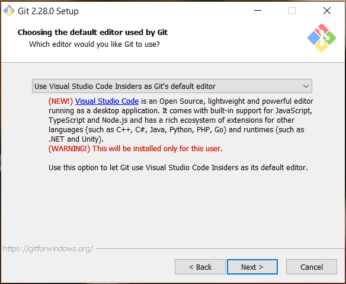
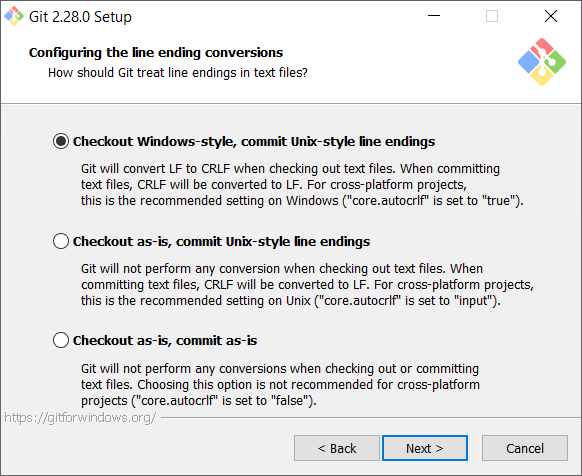
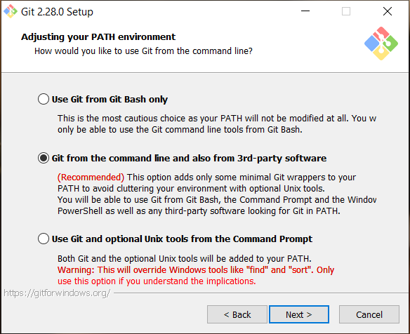
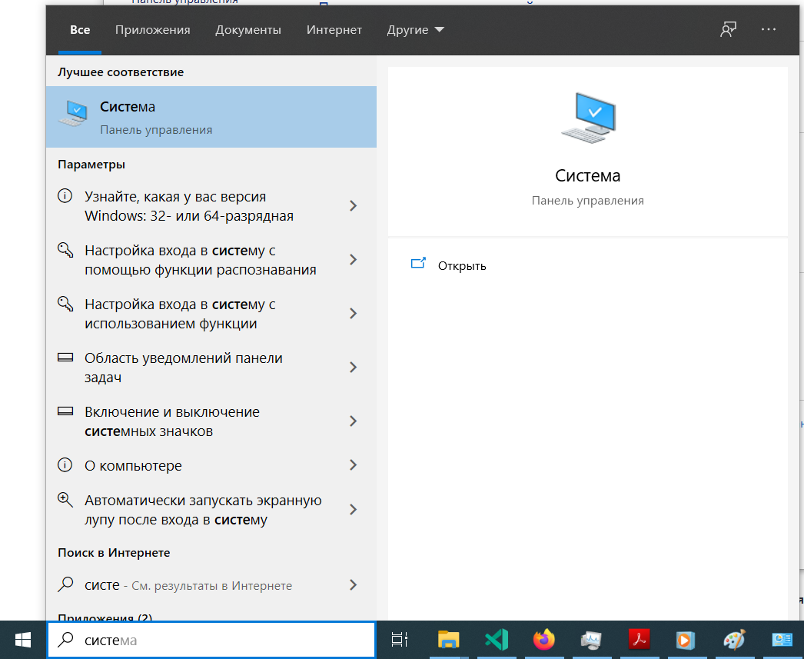
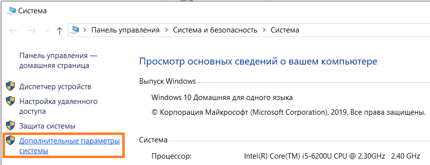
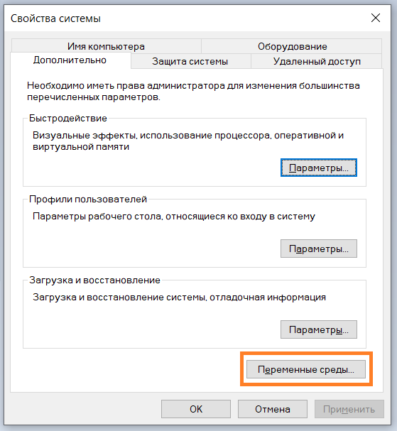
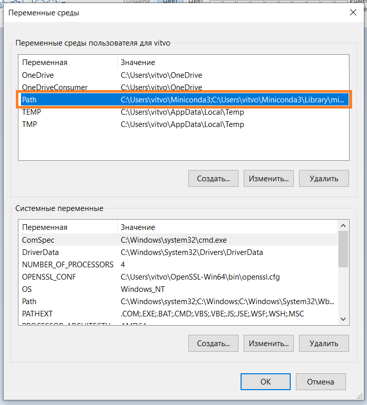
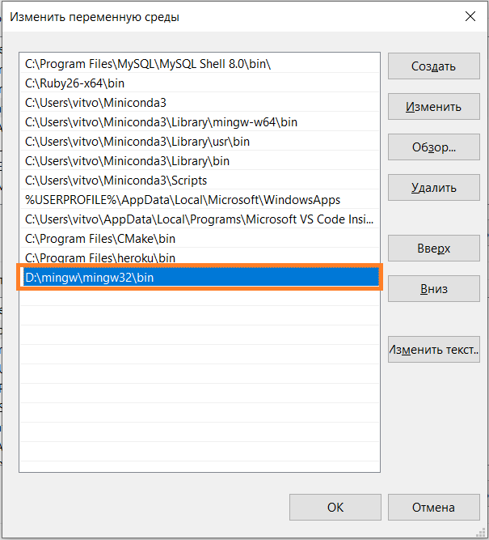
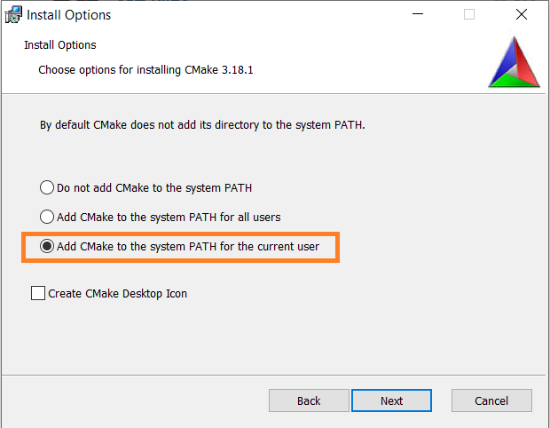
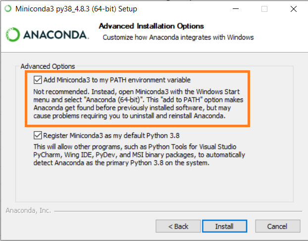

Для работы над заданиями курса в Windows 10 рекомендуется использовать следующее программное окружение:

* Редактор [Visual Studio Code](https://code.visualstudio.com/)
* Инструменты командной строки [Git for Windows](https://git-scm.com/download/win)
* ПО для C++:
  * Среда разработки [MinGW-w64](https://en.wikipedia.org/wiki/Mingw-w64) (Minimalist GNU for Windows), содержащая компилятор [GCC](https://en.wikipedia.org/wiki/GNU_Compiler_Collection) (GNU Compiler Collection)
  * Инструменты для сборки проектов [CMake](https://cmake.org/)
* ПО для python:
  * Система управления пакетами python [Miniconda3](https://docs.conda.io/en/latest/miniconda.html)

Рассмотрим далее процесс установки и настройки этих инструментов.

## Установка VS Code

Установка VS Code не представляет сложностей. Достаточно скачать установочный файл со [страницы загрузок](https://code.visualstudio.com/Download) и запустить его. Пока это все что необходимо сделать. Далее мы будем устанавливать различные дополнения VS Code, которые позволят более удобно работать с языками C++ и python, с системой контроля версий git и системой для сборки проектов CMake.

## Установка и настройка Git for Windows

Чтобы установить инструмены командной строки git нужно скачать установочный файл со [страницы загрузок](https://git-scm.com/downloads) и запустить его. На момент написания этого текста актуальной версией является 2.28.0. В процессе установки Вам будут заданы вопросы по конфигурации. В большинстве случаев подойдут рекомендуемые варианты.

Если в системе уже установлен редактор VS Code, то его можно выбрать в качестве редактора по умолчанию для Git:



Важным моментом является настройка обработки конца строки в файлах. Чтобы с этим не возникало проблем, необходимо выбрать вариант, который уже отмечен по умолчанию:



Наконец, чтобы команды git были доступны во всех терминалах, следует выбрать рекомендуемый вариант для изменения переменной окружения PATH:



Чтобы проверить, что установка завершилась успешно, откройте терминал и исполните команду `git`. Результат должен выглядеть так:

```sh
> git
usage: git [--version] [--help] [-C <path>] [-c <name>=<value>]
           [--exec-path[=<path>]] [--html-path] [--man-path]
           [--info-path] [-p | --paginate | -P | --no-pager]
           [--no-replace-objects] [--bare] [--git-dir=<path>]
           [--work-tree=<path>] [--namespace=<name>]
           <command> [<args>]
```

В качестве терминала в Windows 10 мы рекомендуем использовать [PowerShell](https://ru.wikipedia.org/wiki/PowerShell).

Далее следует задать имя пользователя и адрес электронной почты, которые соответствуют Вашему аккунту на GitHub:

```sh
$ git config --global user.name "Ivan Petrov"
$ git config --global user.email i.petrob@nsu.ru
```

Git хранит настройки в файле `~\.gitconfig`. У автора этот файл выглядит следующим образом:

```sh
[user]
	email = vit.vorobiev@gmail.com
	name = Vitaly Vorobyev
[core]
	editor = \"[path-to-vscode]" --wait

```

На этом первоначальная конфигурация инструментов git завершена. Навык работы с git приходит с практикой. Действия с git, необходимые для выполнения заданий курса, всегда будут подробно описаны. Тем не менее, мы рекомендуем обращаться к [документации](https://git-scm.com/book/ru/v2), чтобы прояснять непонятные моменты.

## Установка MinGW-w64

Установочный файл MinGW-w64 `mingw-w64-install.exe` можно найти на [этой странице](https://sourceforge.net/projects/mingw-w64/files/Toolchains%20targetting%20Win32/Personal%20Builds/mingw-builds/installer/). При установке не нужно менять настрйки по умолчанию, кроме пути установки. **Путь установки не должен содержать пробелов**, поэтому путь по умолчанию в директории `Program Files` не подходит.

После заверщения установки, в директории `mingw32\bin` будут расположены различные исполняемые файлы. Из этих файлов нас интересует `g++.exe`, который запускает сборку программ C++. Сделаем так, чтобы этот файл был доступен в любой директории из командной строки. Если этого не сделать, то для использования команды `g++` надо будет прописывать полный путь до файла `g++.exe`.

Откройте меню "Система" в "Панели управления":




Из меню "Система" перейдите в "Дополнительные параметры системы":



Выберите "Переменные среды":



Выберите переменную `Path` и нажмите кнопку "Изменить...":



Добавьте в новую строку полный путь до директории `mingw32\bin` и нажмите кнопку OK.

Чтобы проверить, что настройка выполнена успешно, откройте консоль (не в директории `mingw32\bin`) и выполните команду `g++ --help`:

```sh
> g++ --help
Usage: g++.exe [options] file...
```

Ваша система теперь готова к сборке программ на языке C++.

## Установка CMake

Скачайте со [станицы загрузок](https://cmake.org/download/) установочный файл `cmake-3.18.1-win64-x64.msi` (на момент написания текста актуальная версия - 3.18.1). Для 32-разрядной системы вместо этого нужно скачать файл `cmake-3.18.1-win32-x86.msi`. Запустите файл и выполните установку. В ходе установки выберите изменение переменной окружения PATH:



Набирите в консоле команду `cmake --help` для проверки корректности установки CMake:

```sh
> cmake --help
Usage

  cmake [options] <path-to-source>
  cmake [options] <path-to-existing-build>
  cmake [options] -S <path-to-source> -B <path-to-build>

Specify a source directory to (re-)generate a build system for it in the
current working directory.  Specify an existing build directory to
re-generate its build system.
```

Код большинства заданий по C++ этого курса будет компилироваться с помощью системы сборки CMake. Эта система значительно упрощает процесс сборки C++ проектов, особенно если они состояит из многих файлов.

## Установка Miniconda3

Система Windows (в отличие от Linux) не имеет установенного по умолчанию интерпретатора python. Менеджер пакетов python Conda, и его минимальная сборка Miniconda позволят нам установить в системы все необходимые инструменты для работы с python. Загрузите со [страницы загрузки](https://docs.conda.io/en/latest/miniconda.html) установочный файл `Miniconda3 Windows 64-bit` или `Miniconda3 Windows 32-bit`, в зависимости от разрядности системы. При установке установите галочку для добавления необходимых записей в переменную окружения PATH, несмотря на то что это действите не рекомендуется установщиком:



Убедитесь в том, что установка выполнена успешно, выполнив следующую команду в консоли:

```sh
>conda --help
usage: conda-script.py [-h] [-V] command ...

conda is a tool for managing and deploying applications, environments and packages.
```

Выполните инициализацию (необходимо выполнить один раз):

```sh
>conda init
```

Создадим окружение для работы с заданями этого курса:

```sh
>conda create -n nsu python=3
```

Conda вычислит набор пакетов, которые необходимо установить в новом окружении, и попросит подтвердить создание окружения:

```sh
Proceed ([y]/n)? y
```

После установки активируйте новое окружение и запустите консоль python:

```sh
>conda activate nsu
(nsu) >python
Python 3.8.5 (default, Aug  5 2020, 09:44:06) [MSC v.1916 64 bit (AMD64)] :: Anaconda, Inc. on win32
Type "help", "copyright", "credits" or "license" for more information.
>>>
```

Теперь Ваша система полностью настроена для работы с заданиями курса "Программирование на C++ и python". Нам осталось настроить редактор VS Code для максимально удобной работы.

## Настройка VS Code


## Источники

* [First-Time Git Setup](https://git-scm.com/book/en/v2/Getting-Started-First-Time-Git-Setup)
* [Git in Visual Studio Code](https://git-scm.com/book/en/v2/Appendix-A%3A-Git-in-Other-Environments-Git-in-Visual-Studio-Code)
* [Using GCC with MinGW](https://code.visualstudio.com/docs/cpp/config-mingw)
