Библиотека matplotlib содержит большой набор инструментов для двумерной графики. Она проста в использовании и позволяет получать графики публикационного качества. В этом разделе мы рассмотрим наиболее распространенные типы диаграмм и различные настройки их отображения.

Модуль [`matplotlib.pyplot`](https://matplotlib.org/3.1.1/api/_as_gen/matplotlib.pyplot.html) предоставляет процедурный интерфейс к (объектно-ориентированной) библиотеке matplotlib, который во многом копирует инструменты пакета [MATLAB](https://www.mathworks.com/products/matlab.html). Инструменты модуля `pyplot` де-факто являются стандартным способом работы с библиотекой `matplotlib`, поэтому мы органичимся рассмотрением этого пакета.

## Двумерные графики

### pyplot.plot

Нарисовать графики функций sin и cos с matplotlib.pyplot можно слудующим образом:

```py
import numpy as np
import matplotlib.pyplot as plt

phi = np.linspace(0, 2.*np.pi, 100)
plt.plot(phi, np.sin(phi))
plt.plot(phi, np.cos(phi))

plt.show()
```

В результате получаем

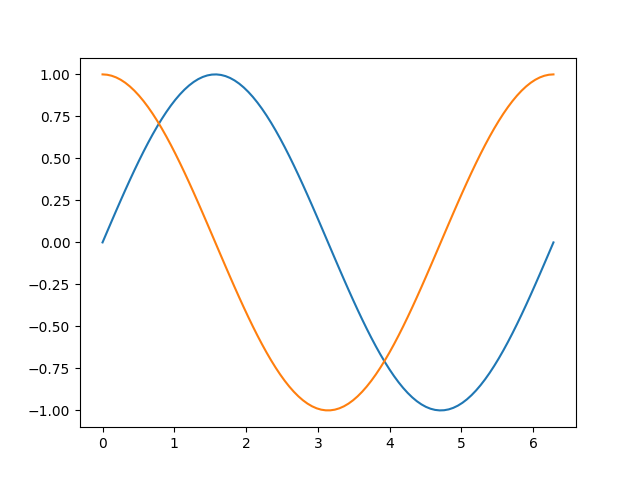

Мы использовали функцию [plot](https://matplotlib.org/api/_as_gen/matplotlib.pyplot.plot.html), которой передали два параметра - списки значений по горизонтальной и вертикальной осям. При последовательных вызовах функции plot графики строятся в одних осях, при этом происходит автоматическое переключение цвета.

Строковый параметр

```py
fmt = '[marker][line][color]'
```

функции plot позволяет задавать тип маркера, тип линии и цвет. Приведем несколько примеров:

```py
x = np.linspace(0, 1, 100)
f1 = 0.25 - (x - 0.5)**2
f2 = x**3
plt.plot(x, f1, ':b')    # пунктирная синяя линия
plt.plot(x, f2, '--r')   # штрихованная красная линия
plt.plot(x, f1+f2, 'k')  # черная непрерывная линия

plt.show()
```


```py
rg = np.random.Generator(np.random.PCG64())
plt.plot(rg.binomial(10, 0.3, 6), 'ob')  # синие круги
plt.plot(rg.poisson(7, 6), 'vr')         # красные треугольники
plt.plot(rg.integers(0, 10, 6), 'Dk')    # черные ромбы

plt.show()
```


Из последнего примера видно, что если в функцию plot передать только один список `y`, то он будет использован для значений по вертикальной оси. В качестве значений по горизонтальной оси будет использован `range(len(y))`.

Более тонкую настройку параметров можно выполнить, передавая различные именованные аргументы, например:

* marker - тип маркера
* markersize - размер маркера
* linestyle - тип линии
* linewidth - толщина линии
* color - цвет

Полный список доступных параметров можно найти [в документации](https://matplotlib.org/api/_as_gen/matplotlib.lines.Line2D.html#matplotlib.lines.Line2D).

### pyplot.errorbar

Результаты измерений в физике чаще всего представлены в виде величин с ошибками. Функция [`plt.errorbar`](https://matplotlib.org/api/_as_gen/matplotlib.pyplot.errorbar.html#matplotlib.pyplot.errorbar) позволяет отображать такие данные:

```py
rg = np.random.Generator(np.random.PCG64(5))
x = np.arange(6)
y = rg.poisson(149, x.size)
plt.errorbar(x, y, yerr=np.sqrt(y), marker='o', linestyle='none')
plt.show()
```

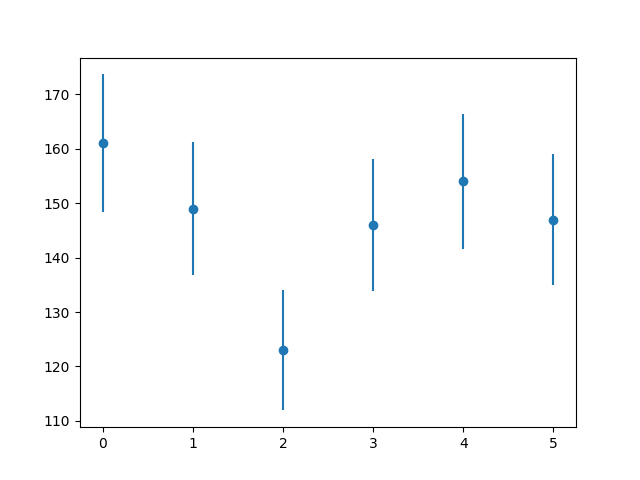

Ошибки можно задавать и для значений по горизонтальной оси:

```py
rg = np.random.Generator(np.random.PCG64(5))
N = 6
x = rg.poisson(169, N)
y = rg.poisson(149, N)
plt.errorbar(x, y, xerr=np.sqrt(x), yerr=np.sqrt(y), marker='o', linestyle='none')
plt.show()
```

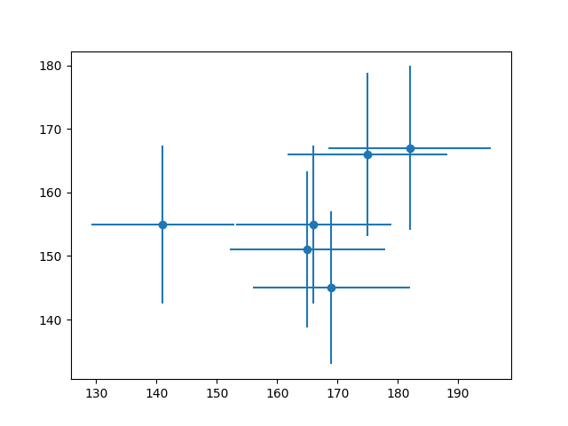

Ошибки измерений могут быть асимметричными. Для их отображения в качестве параметра `yerr` (или `xerr`) необходимо передать кортеж из двух списков:

```py
rg = np.random.Generator(np.random.PCG64(11))
N = 6
x = np.arange(N)
y = rg.poisson(149, N)
yerr = [
    0.7*np.sqrt(y),
    1.2*np.sqrt(y)
]
plt.errorbar(x, y, yerr=yerr, marker='o', linestyle='none')
plt.show()
```

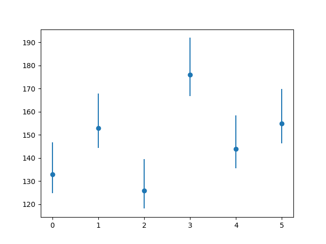

Функция `pyplot.errorbar` поддерживает настройку отображения графика с помощью параметра `fmt` и всех именованных параметров, которые доступны в функции `pyplot`. Кроме того, здесь появляются параметры для настройки отображения линий ошибок ("усов"):

* ecolor - цвет линий ошибок
* elinewidth - ширина линий ошибок
* capsize - длина "колпачков" на концах линий ошибок
* capthick - толщина "колпачков" на концах линий ошибок

и некоторые другие. Изменим параметры отрисовки данных из предыдущего примера:

```py
# ...
plt.errorbar(x, y, yerr=yerr, marker='o', linestyle='none',
    ecolor='k', elinewidth=0.8, capsize=4, capthick=1)
plt.show()
```

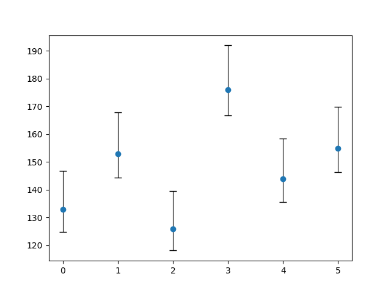

## Настройки отображения

Наши графики все еще выглядят довольно наивно. В этой части мы рассмотрим различные настройки, которые позволят достичь качества диаграмм публикационного уровня.

### Диапазон значений осей

Задавать диапазон значений осей в matplotlib можно несколькими способами. Например, так:

```py
pyplot.xlim([0, 200])  # диапазон горизонтальной оси от 0 до 200
pyplot.xlim([0, 1])    # диапазон вертикальной оси от 0 до 1
```

### Размер шрифта

Размер и другие свойста шрифта, который используется в matplotlib по умолчанию, можно изменить с помощью объекта `matplotlib.rcParams`:

```py
matplotlib.rcParams.update({'font.size': 14})
```

Объект `matplotlib.rcParams` хранит множество настроек, изменяя которые, можно управлять поведением по умолчанию. Смотрите подробнее в [документации](https://matplotlib.org/tutorials/introductory/customizing.html).

### Подписи осей

Подписи к осям задаются следующим образом:

```py
plt.xlabel('run number', fontsize=16)
plt.ylabel(r'average current ($\mu A$)', fontsize=16)
```

В подписях к осям (и вообще в любом тексте в matplotlib) можно использовать инструменты текстовой разметки [TeX](https://en.wikipedia.org/wiki/TeX), позволяющие отрисовывать различные математические выражения. TeX-выражения должны быть внутри пары символов `$`, кроме того, их следует помещать в r-строки, чтобы избежать неправильной обработки.

### Заголовок

Функция `pyplot.title` задает заголовок диаграммы. Применим наши новые знания:

```py
import numpy as np
import matplotlib.pyplot as plt
import matplotlib

# задаем размер шрифта
matplotlib.rcParams.update({'font.size': 12})

rg = np.random.Generator(np.random.PCG64(11))
x = np.arange(6)
y = rg.poisson(149, x.size)
yerr = [
    0.7*np.sqrt(y),
    1.2*np.sqrt(y)
]
plt.errorbar(x, y, yerr=yerr, marker='o', linestyle='none',
    ecolor='k', elinewidth=0.8, capsize=4, capthick=1)

# добавляем подписи к осям и заголовок диаграммы
plt.xlabel('run number', fontsize=16)
plt.ylabel(r'average current ($\mu A$)', fontsize=16)
plt.title(r'The $\alpha^\prime$ experiment. Season 2020-2021')

# задаем диапазон значений оси y
plt.ylim([0, 200])
# оптимизируем поля и расположение объектов
plt.tight_layout()

plt.show()
```


В этом примере мы использовали функцию [pyplot.tight_layout](https://matplotlib.org/tutorials/intermediate/tight_layout_guide.html), которая автоматически подбирает параметры отображения так, чтобы различные элементы не пересекались.

### Легенда

При построении нескольких графиков в одних осях поезно добавлять легенду - пояснения к каждой линии. Следующий пример показывает, как это делается с помощью аргументов `label` и функции [`pyplot.legend`](https://matplotlib.org/3.1.1/api/_as_gen/matplotlib.pyplot.legend.html):

```py
import numpy as np
import matplotlib.pyplot as plt
import matplotlib

matplotlib.rcParams.update({'font.size': 12})

x = np.linspace(0, 1, 100)
f1 = 0.25 - (x - 0.5)**2
f2 = x**3

# указываем в аргументе label содержание легенты 
plt.plot(x, f1, ':b', label='1st component')
plt.plot(x, f2, '--r', label='2nd component')
plt.plot(x, f1+f2, 'k', label='total')

plt.xlabel(r'$x$', fontsize=16)
plt.ylabel(r'$f(x)$', fontsize=16)

plt.xlim([0, 1])
plt.ylim([0, 1])

# выводим легенду
plt.legend(fontsize=14)

plt.tight_layout()

plt.savefig(f'plots/mpl{exno}.png')

plt.show()
```

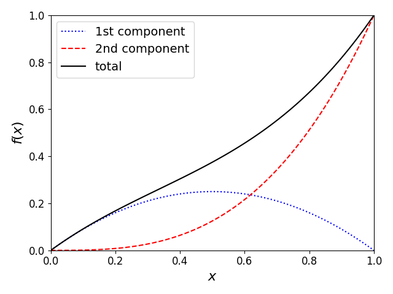

Функция `pyplot.legend` старается расположить легенду так, чтобы она не пересекала графики. Аргумент `loc` позволяет задать расположение легенды вручную. В большинстве случаев расположение по умолчанию получается удачным. Детали и описание других аргументов смотрите в [документации](https://matplotlib.org/3.1.1/api/_as_gen/matplotlib.pyplot.legend.html).

### Сетка

Сетка во многих случаях облегчает анализ графиков. Включить отображение сетки можно с помощью функции `pyplot.grid`. Аргумент `axis` этой функции имеет три возможных значения: `x`, `y` и `both` и определяет оси, вдоль которых будут проведены линии сетки. Управлять свойствами линии сетки можно с помощью именованых аргументов, которые мы рассматривали выше при обсуждении функции `pyplot.plot`.

В matplotlib поддерживается два типа сеток: основная и дополнительная. Выбор типа сетки выполняется с помощью аргумента `which`, который может принимать три значения: `major`, `minor` и `both`. По умолчанию используется основная сетка.

Линии сетки привязаны к отметкам на осях. Чтобы работать с дополнительной сеткой необходимо сначала включить вспомогательные отметки на осях (которые по умолчанию отключены и к которым привязаны линии дополнительной сетки) с помощью функции `pyplot.minorticks_on`. Приведем пример:

```py
import numpy as np
import matplotlib.pyplot as plt
import matplotlib

matplotlib.rcParams.update({'font.size': 12})

x = np.linspace(-1, 1, 250)
plt.plot(x, x, label=r'$x$')
plt.plot(x, x**2, label=r'$x^2$')
plt.plot(x, x**3, label=r'$x^3$')
plt.plot(x, np.cbrt(x), label=r'$x^{1/3}$')
plt.legend(fontsize=16)

# включаем дополнительные отметки на осях
plt.minorticks_on()
plt.xlabel(r'$x$', fontsize=16)

plt.xlim([-1., 1.])
plt.ylim([-1., 1.])
# включаем основную сетку
plt.grid(which='major')
# включаем дополнительную сетку
plt.grid(which='minor', linestyle=':')
plt.tight_layout()

plt.show()
```

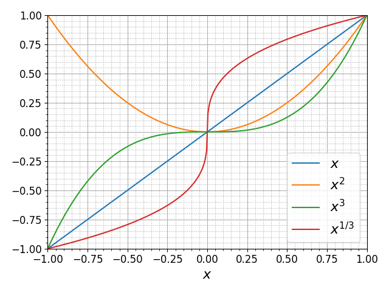

### Логарифмический масштаб

Функции `pyplot.semilogy` и `pyplot.semilogx` выполняют переключение между линейным и логарифмическим масштабами осей. В некоторых случаях логарифмический масштаб позволяет отобразить особенности зависимостей, которые не видны в линейном масштабе. Вот так выглядят графики экспоненциальных функций в линейном масштабе:


Добавление строки

```py
plt.semilogy()
```

делает график гораздо более информативным:

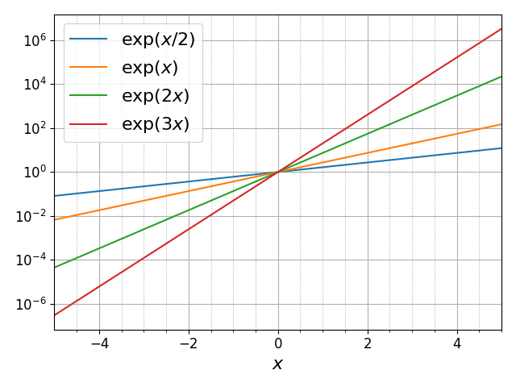

Теперь мы видим поведение функций во всем динамическом диапазоне, занимающем 12 порядков.

### Произвольные отметки на осях

Вернемся к первому примеру, в котором мы строили графики синуса и косинуса. Сделаем так, чтобы на горизонтальной оси отметки соответствовали различным долям числа pi и имели соответствуеющие подписи:


Метки на горизонтальной оси были заданы с помощью функции `pyplot.xticks`:

```py
plt.xticks(
    np.linspace(-np.pi, np.pi, 9),
    [r'$-\pi$', r'$-3\pi/4$', r'$-\pi/2$', r'$-\pi/4$', r'$0$',
     r'$\pi/4$', r'$+\pi/2$', r'$3\pi/4$', r'$+\pi$'])
```

Модуль [`pyplot.ticker`](https://matplotlib.org/api/ticker_api.html) содержит более продвинутые инструменты для управления отметками на осях. Подробности смотрите в [документации](https://matplotlib.org/gallery/ticks_and_spines/tick-locators.html).

### Размер изображения

До сих пор мы строили графики в одном окне, размер которого был задан по умолчанию. За кадром matplotlib создавал объект типа [Figure](https://matplotlib.org/3.3.0/api/_as_gen/matplotlib.figure.Figure.html), который определяет размер окна и содержит все остальные элементы. Кроме того, автоматически создавался объект типа [Axis](https://matplotlib.org/3.1.1/api/axes_api.html). Подробнее работа с этими объектами будет рассмотрена ниже. Сейчас же мы рассмотрим функцию [`pyplot.figure`](https://matplotlib.org/3.3.0/api/_as_gen/matplotlib.pyplot.figure.html), которая позволяет создавать новые объекты типа `Figure` и переключаться между уже созданными объектами.

Функция `pyplot.figure` может принимать множество аргументов. Вот основные:

* `num` уникальный идентификатор объекта типа `int` или `str`. Если задан новый идентификатор, то создается новый объект и он становится активным. В случае, если передан идентификатор уже существующего объекта, то этот объект возвращается и становится активным
* `figsize` - кортеж `(float, float)` - размер изображения в дюймах
* `dpi` - `float` - разрешение в количестве точек на дюйм

Описание других параметров функции `pyplot.figure` можно найти в [документации](https://matplotlib.org/3.3.0/api/_as_gen/matplotlib.pyplot.figure.html). Используем эту функцию и функцию `pyplot.axis` чтобы улучшить наш пример с построением степенных функций:

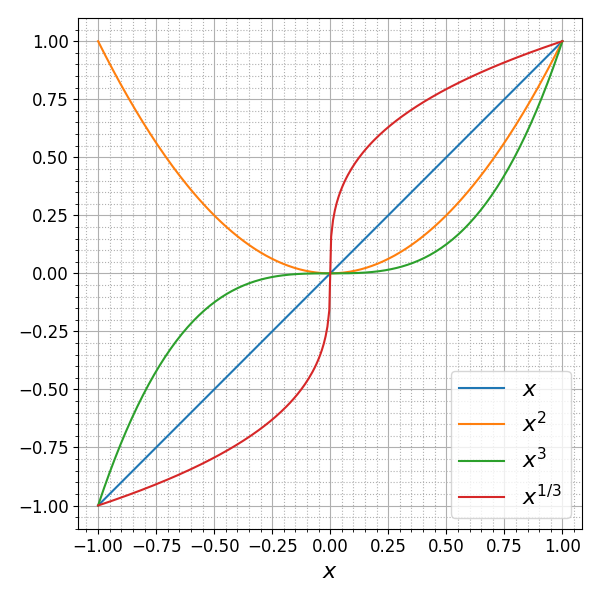

Мы добавили две строки по сравнению с прошлой версией:

```py
fig = plt.figure(figsize=(6, 6))
# ...
plt.axis('equal')
```

Функция [`pyplot.axis`](https://matplotlib.org/api/_as_gen/matplotlib.pyplot.axis.html) позволяет задавать некоторые свойства осей. Ее вызов с параметром `'equal'` делает одинаковыми масштабы вертикальной и горизонтальной осей, что кажется хорошей идеей в этом примере. Функция `pyplot.axis` возвращает кортеж из четырех значений `xmin, xmax, ymin, ymax`, соответствующих границам диапазонов значений осей.

Некоторые другие способы использования функции `pyplot.axis`:

* Кортеж из четырех `float` задаст новые границы диапазонов значений осей
* Строка `'off'` выключит отображение линий и меток осей

## Гистограммы

Обратимся теперь к другим типам диаграмм. Функция [`pyplot.hist`](https://matplotlib.org/api/_as_gen/matplotlib.pyplot.hist.html) строит гистограмму по набору значений:

```py
import numpy as np
import matplotlib.pyplot as plt

rg = np.random.Generator(np.random.PCG64(5))
data = rg.poisson(145, 10000)
plt.hist(data, bins=40)
# для краткости мы опускаем код для настройки осей, сетки и т.д.
```

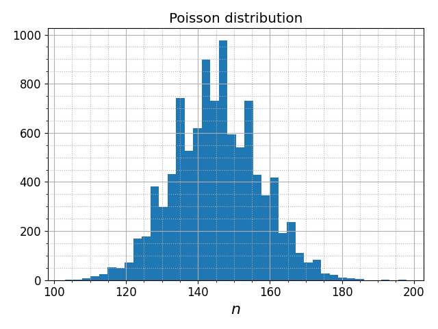

Аргумент `bins` задает количество бинов гистограммы. По умолчанию используется значение 10. Если вместо целого числа в аргумент `bins` передать кортеж значений, то они будут использованы для задания границ бинов. Таким образом можно постороить гистограмму с произвольным разбиением.

Некоторые другие аргументы функции `pyplot.hist`:

* `range` - кортеж из двух значений. Определяет диапазон значений, в котором строится гистограмма. Значения за пределами заданного диапазона игнорируются.
* `density` - `bool`. При значении `True` будет построена гистограмма, соответствующая плотности вероятности, так что площадь гистограммы будет равна единице.
* `weights` - список `float` значений того же размера, что и набор данных. Определяет вес каждого значения при построении гистограммы.
* `histtype` может принимать значения `{'bar', 'barstacked', 'step', 'stepfilled'}`. Определяет тип отрисовки гистограммы.

В качестве первого аргумента можно передать кортеж наборов значений. Для каждого из них будет построена гистограмма. Аргумент `stacked` со значением `True` позволяет строить сумму гистограмм для кортежа наборов. Покажем несколько примеров:

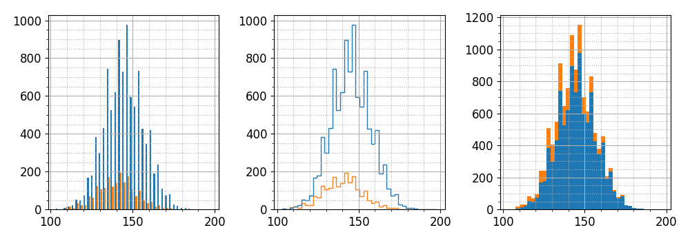

```py
rg = np.random.Generator(np.random.PCG64(5))
data1 = rg.poisson(145, 10000)
data2 = rg.poisson(140, 2000)

# левая гистограмма
plt.hist([data1, data2], bins=40)
# центральная гистограмма
plt.hist([data1, data2], bins=40, histtype='step')
# правая гистограмма
plt.hist([data1, data2], bins=40, stacked=True)
```

В физике гистограммы часто представляют в виде набора значений с ошибками, предполагая при этом, что количество событий в каждом бине является случайной величиной, подчиняющейся биномиальному распределению. В пределе больших значений флуктуации количества событий в бине могут быть описаны распределением Пуассона, так что характерная величина флуктуации определяется корнем из числа событий. Библиотека `matplotlib` не имеет инструмента для такого представления данных, однако его легко получить с помощью комбинации `numpy.histogram` и `pyplot.errorbar`:

```py
def poisson_hist(data, bins=60, lims=None):
    """ Гистограмма в виде набора значений с ошибками """
    hist, bins = np.histogram(data, bins=bins, range=lims)
    bins = 0.5 * (bins[1:] + bins[:-1])
    return (bins, hist, np.sqrt(hist))

rg = np.random.Generator(np.random.PCG64(5))
data = rg.poisson(145, 10000)

x, y, yerr = poisson_hist(data, bins=40, lims=(100, 190))
plt.errorbar(x, y, yerr=yerr, marker='o', markersize=4,
             linestyle='none', ecolor='k', elinewidth=0.8,
             capsize=3, capthick=1)
```

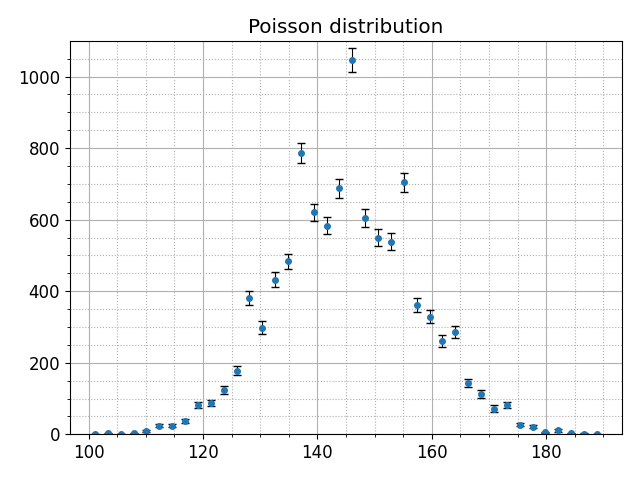

## Диаграммы рассеяния

Распределение событий по двум измерениям удобно визуализировать с помощью [диаграммы рассеяния](https://en.wikipedia.org/wiki/Scatter_plot):

```py
rg = np.random.Generator(np.random.PCG64(5))

means = (0.5, 0.9)
covar = [
    [1., 0.6],
    [0.6, 1.]
]
data = rg.multivariate_normal(means, covar, 5000)

plt.scatter(data[:,0], data[:,1], marker='o', s=1)
```

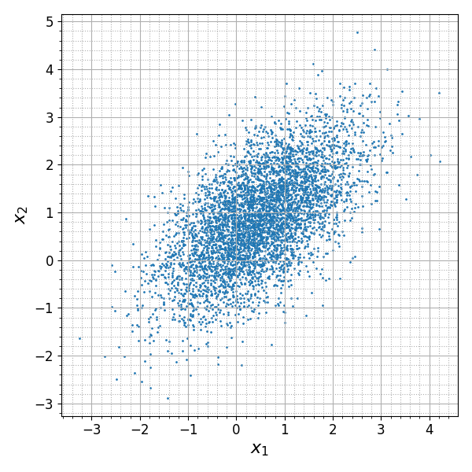

Каждой паре значений в наборе данных соответствует одна точка на диаграмме. Несмотря на свою простоту, диаграмма рассеяния позволяет во многих случаях наглядно представлять двумерные данные. Функция [pyplot.scatter](https://matplotlib.org/api/_as_gen/matplotlib.pyplot.scatter.html) позволяет визуализировать и данные более высокой размерности: размер и цвет маркера могут быть заданы для каждой точки отдельно:

```py
rg = np.random.Generator(np.random.PCG64(4))

data = rg.uniform(-1, 1, (50, 2))
col = np.arctan2(data[:, 1], data[:, 0])
size = 100*np.sum(data**2, axis=1)

plt.scatter(data[:,0], data[:,1], marker='o', s=size, c=col)
```

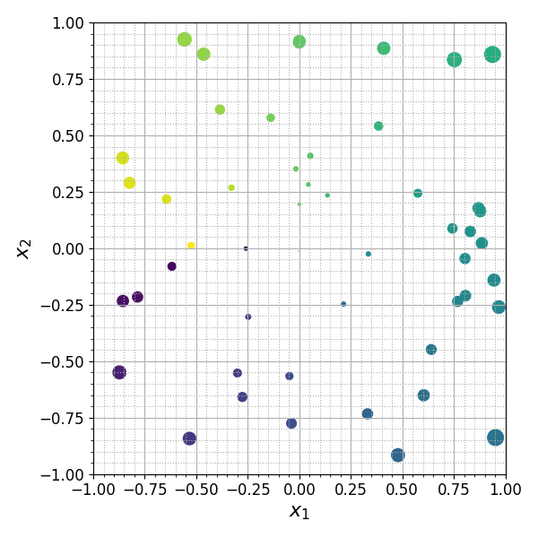

Цветовую палитру можно задать с помощью аргумента `cmap`. Подробности и описание других аргументов функции `pyplot.scatter` можно найти в [документации](https://matplotlib.org/api/_as_gen/matplotlib.pyplot.scatter.html).

## Контурные диаграммы

Контурные диаграммы позволяют визуализировать функции двух переменных:

```py
from scipy import stats

means = (0.5, 0.9)
covar = [
    [1., 0.6],
    [0.6, 1.]
]

mvn = stats.multivariate_normal(means, covar)
x, y = np.meshgrid(
    np.linspace(-3, 3, 80),
    np.linspace(-2, 4, 80)
)
data = np.dstack((x, y))

# левая диаграмма - без заливки цветом
plt.contour(x, y, mvn.pdf(data), levels=10)
# правая диаграмма - с заливкой цветом
plt.contourf(x, y, mvn.pdf(data), levels=10)
```

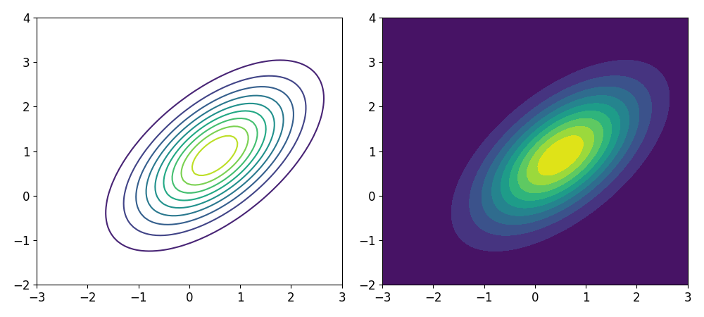

Аргумент `levels` задает количество контуров. По умолчанию контуры отрисовываются равномерно между максимальным и минимальным значениями. В аргумент `levels` также можно передать список уровней, на которых следует провести контуры.

Обратите внимание на использование функций [numpy.meshgrid](https://numpy.org/doc/stable/reference/generated/numpy.meshgrid.html) и [numpy.dstack](https://numpy.org/doc/stable/reference/generated/numpy.dstack.html) в этом примере.

Контурную диаграмму можно дополнить цветовой полосой [`colorbar`](https://matplotlib.org/api/colorbar_api.html#matplotlib.colorbar.Colorbar), вызвав функцию [`pyplot.colorbar`](https://matplotlib.org/api/_as_gen/matplotlib.pyplot.colorbar.html):

```py
cs = plt.contourf(x, y, mvn.pdf(data), levels=15,
                  cmap=matplotlib.cm.magma_r)
cbar = plt.colorbar(cs)
```

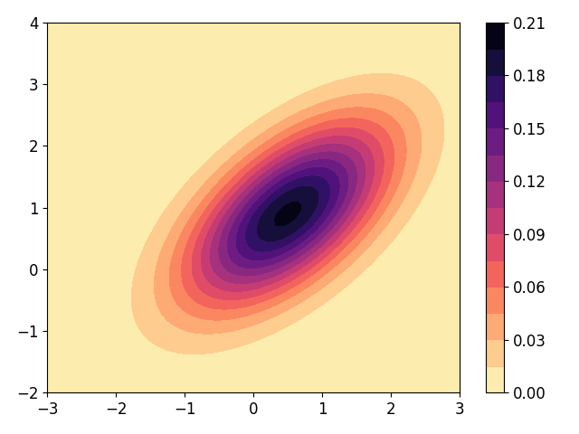

Более подробное описание функций `plt.contour` и `plt.contourf` смотрите в [документации](https://matplotlib.org/api/_as_gen/matplotlib.pyplot.contourf.html).

## Расположение нескольких осей в одном окне

В одном окне (объекте [`Figure`](https://matplotlib.org/3.3.0/api/_as_gen/matplotlib.figure.Figure.html)) можно разместить несколько осей (объектов [`axis.Axis`](https://matplotlib.org/3.3.0/api/axes_api.html#the-axes-class)). Функция [`pyplot.subplots`](https://matplotlib.org/api/_as_gen/matplotlib.pyplot.subplots.html) создает объект `Figure`, содержащий регулярную сетку объектов `axis.Axis`:



```py
import numpy as np
from scipy import stats
import matplotlib.pyplot as plt

fig, axes = plt.subplots(ncols=3, nrows=2, figsize=(12, 8))
x = np.linspace(0.01, 25, 250)

for idx, row in enumerate(axes):
    for jdx, ax in enumerate(row):
        ndf = idx * 3 + jdx + 1
        y = stats.chi2.pdf(x, ndf)
        ax.plot(x, y, label=fr'$\chi^2_{{ndf={ndf}}}(x)$')
        ax.set_xlabel(r'$x$', fontsize=16)
        ax.set_ylim([0, 1.05*y.max()])
        ax.minorticks_on()
        ax.legend(fontsize=16)
        ax.grid(which='major')
        ax.grid(which='minor', linestyle=':')

fig.tight_layout()
plt.show()
```



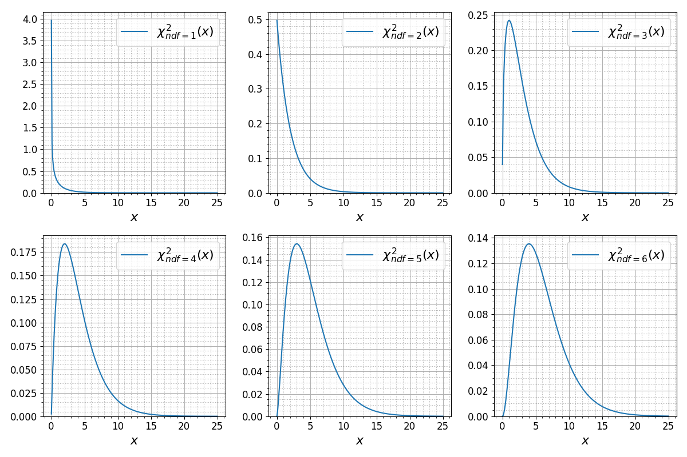

Количество строк и столбцов, по которым располагаются различные оси, задаются с помощью параметров `nrows` и `ncols`, соответственно. Функция `pyplot.subplots` возвращает объект `Figure` и двумерный список осей `axis.Axis`. Обратите внимание на то, что вместо вызовов функций модуля `pyplot` в этом примере использовались вызовы методов классов `Figure` и `axis.Axis`.

В последнем примере горизонтальная ось во всех графиках имеет один и тот же диапазон. Аргумент `sharex` функции `pyplot.subplots` позволяет убрать лишнее дублирование отрисовки осей в таких случаях:

```py
fig, axes = plt.subplots(ncols=3, nrows=2, figsize=(12, 8),
                         sharex=True)
# ...
for idx, row in enumerate(axes):
    for jdx, ax in enumerate(row):
        # ...
        if idx:
            ax.set_xlabel(r'$x$', fontsize=16)
```

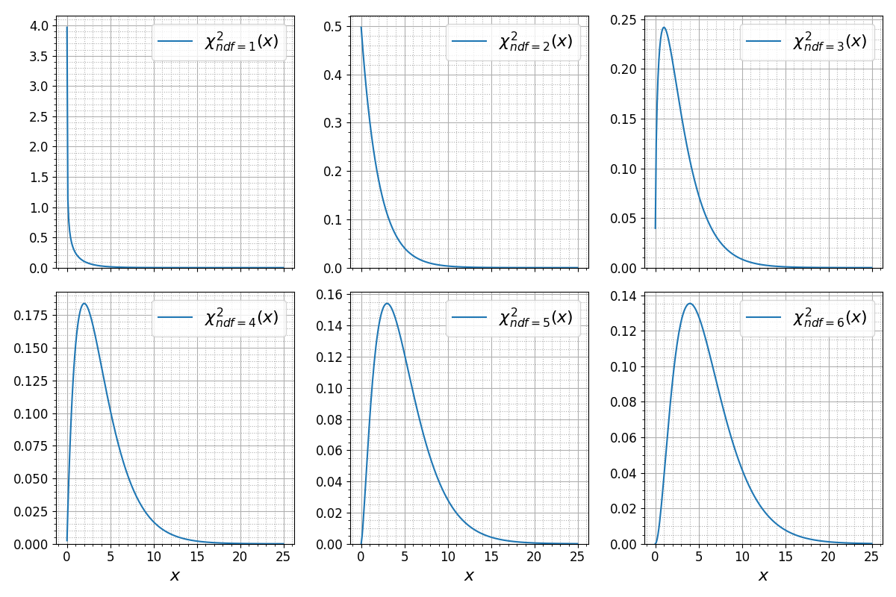

Существует аналогичный параметр `sharey` для вертикальной оси.

Более гибкие возможности регулярного расположения осей предоставляет функция [pyplot.subplot](https://matplotlib.org/api/_as_gen/matplotlib.pyplot.subplot.html). Мы не будем рассматривать эту функцию и ограничимся лишь ее упоминанием.

Функция [`pyplot.axes`](https://matplotlib.org/api/_as_gen/matplotlib.pyplot.axes.html) позволяет добавлять новые оси в текущем окне в произвольном месте:

```py
import numpy as np
import matplotlib.pyplot as plt

exno = 26

rg = np.random.Generator(np.random.PCG64(5))
x1 = rg.exponential(10, 5000)
x2 = rg.normal(10, 0.1, 100)

# Строим основную гистограмму
plt.hist([x1, x2], bins=150, range=(0, 60), stacked=True)
plt.minorticks_on()
plt.xlim((0, 60))
plt.grid(which='major')
plt.grid(which='minor', linestyle=':')

# Строим вторую гистограмму в отдельных осях
plt.axes([.5, .5, .4, .4])
plt.hist([x1, x2], bins=100, stacked=True, range=(9, 11))
plt.grid(which='major')

plt.tight_layout()
plt.show()
```

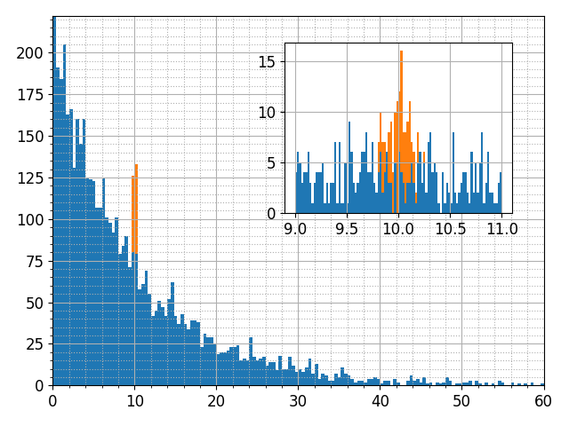

## Резюме

В этом разделе был рассмотрен модуль `pyplot` библиотеки `matplotlib`:

* рассмотрены функции `pyplot.plot`, `pyplot.errorbar`. `pyplot.hist`, `pyplot.scatter`, `pyplot.contour` и `pyplot.contourf`, позволяющие строить диаграммы различных типов;
* рассмотрены средства настройки свойств линий и маркеров;
* рассмотрены инструменты настройки координатных осей: подписи, размер шрифта, координатная сетка, произвольные метки др.;
* рассмотрены инструмены для расположения нескольких координатных осей в одном окне.

Рассмотренные инструменты далеко не исчерпывают возможности библиотеки `matplotlib`, однако их должно быть достаточно в большинстве случаев для визуализации данных публикационного качества. Мы рекомендуем заинтересованному читалелю изучить список источников, в которых можно найти много дополнительной информации.

## Источники

* [matplotlib.pyplot](https://matplotlib.org/3.1.1/api/_as_gen/matplotlib.pyplot.html)
* [Pyplot tutorial](https://matplotlib.org/3.3.0/tutorials/introductory/pyplot.html)
* [Colormaps](https://matplotlib.org/3.1.0/tutorials/colors/colormaps.html)
* [Scipy Lecture Notes](https://scipy-lectures.org/)
