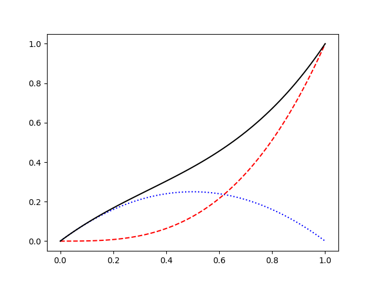
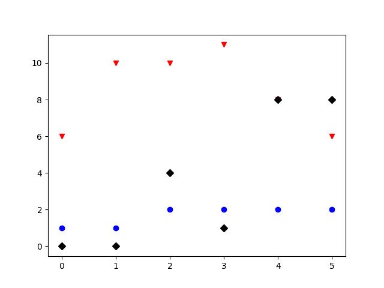

Библиотека matplotlib содержит большой набор инструментов для двумерной графики. Она проста в использовании и позволяет получать графики публикационного качества. В этом разделе мы рассмотрим наиболее распространенные типы диаграмм и различные настройки их отображения.

Модуль [`matplotlib.pyplot`](https://matplotlib.org/3.1.1/api/_as_gen/matplotlib.pyplot.html) предоставляет процедурный интерфейс к (объектно-ориентированной) библиотеке matplotlib, который во многом копирует инструменты пакета [MATLAB](https://www.mathworks.com/products/matlab.html). Инструменты модуля `pyplot` де-факто являются стандартным способом работы с библиотекой `matplotlib`, поэтому мы органичимся рассмотрением этого пакета.

## Двумерные графики

Нарисовать графики функций sin и cos с matplotlib.pyplot можно слудующим образом:

```py
import numpy as np
import matplotlib.pyplot as plt

phi = np.linspace(0, 2.*np.pi, 100)
plt.plot(phi, np.sin(phi))
plt.plot(phi, np.cos(phi))

plt.show()
```

В результате получаем


Мы использовали функцию [plot](https://matplotlib.org/api/_as_gen/matplotlib.pyplot.plot.html), которой передали два параметра - списки значений по горизонтальной и вертикальной осям. При последовательных вызовах функции plot графики строятся в одних осях, при этом происходит автоматическое переключение цвета.

Строковый параметр

```py
fmt = '[marker][line][color]'
```

функции plot позволяет задавать тип маркера, тип линии и цвет. Приведем несколько примеров:

```py
x = np.linspace(0, 1, 100)
f1 = 0.25 - (x - 0.5)**2
f2 = x**3
plt.plot(x, f1, ':b')    # пунктирная синяя линия
plt.plot(x, f2, '--r')   # штрихованная красная линия
plt.plot(x, f1+f2, 'k')  # черная непрерывная линия

plt.show()
```



```py
rg = np.random.Generator(np.random.PCG64())
plt.plot(rg.binomial(10, 0.3, 6), 'ob')  # синие круги
plt.plot(rg.poisson(7, 6), 'vr')         # красные треугольники
plt.plot(rg.integers(0, 10, 6), 'Dk')    # черные ромбы

plt.show()
```



Более тонкую настройку параметров можно выполнить, передавая различные именовенные аргументы, например:

* marker - типа маркера
* merkersize - размер маркера
* linestyle - тип линии
* linewidth - толщина линии
* color - цвет

Полный список доступных параметров можно найти [в документации](https://matplotlib.org/api/_as_gen/matplotlib.lines.Line2D.html#matplotlib.lines.Line2D).

Результат измерения в физике часто представлен в виде величины с ошибкой. Функция `plt.errorbar` позволяет отображать такие данные:

## Настройки отображения

Диапазон осей

Размер шрифта

Подписи осей

Сетка

Легенда

Заголовок

tight_layout

Логарифмический масштаб

Размер изображения

## Гистограммы

## Диаграммы рассеяния

## Контурные диаграммы

## Настройка осей

figure и axis, subplots

## Интерактивные графики

## Источники

* [matplotlib.pyplot](https://matplotlib.org/3.1.1/api/_as_gen/matplotlib.pyplot.html)
* [Scipy Lecture Notes](https://scipy-lectures.org/)
